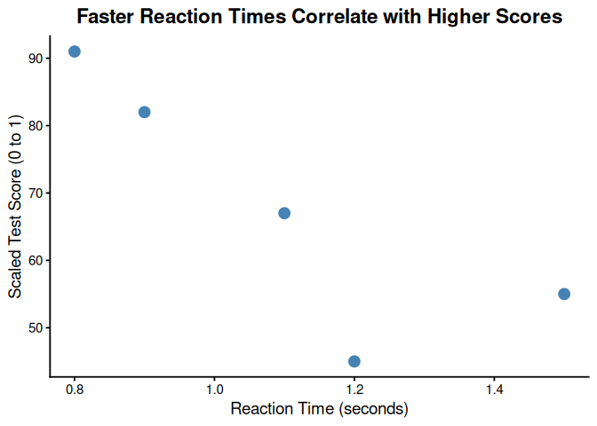

# toypackage

**NOTE: This is a toy package created for expository purposes.**

The goal of `toypackage` is to provide convenience functions for some
common tasks.

## Installation

You can install the development version of `toypackage` from
[GitHub](https://github.com/) with:

``` r

# install.packages("devtools")
devtools::install_github("abhicc/toypackage")
```

## Example

This is a basic example which shows you how to solve a common problem:

``` r

library(toypackage)
```

#### strspit1 example

``` r

first_subject_words <- toy_data$recalled_words[1]
strsplit1(first_subject_words, split = ", ")
#> [1] "cat"   "dog"   "mouse"
```

#### min_max_scale example

``` r

min_max_scale(toy_data$test_score)
#> [1] 0.0000000 0.8043478 0.2173913 1.0000000 0.4782609
```

#### theme_academic example

``` r

library(ggplot2)
ggplot(toy_data, aes(x = reaction_time, y = test_score)) +
geom_point(size = 4, color = "steelblue") +
labs(title = "Faster Reaction Times Correlate with Higher Scores",
x = "Reaction Time (seconds)", y = "Scaled Test Score (0 to 1)") +
theme_academic(base_size = 14)
```


